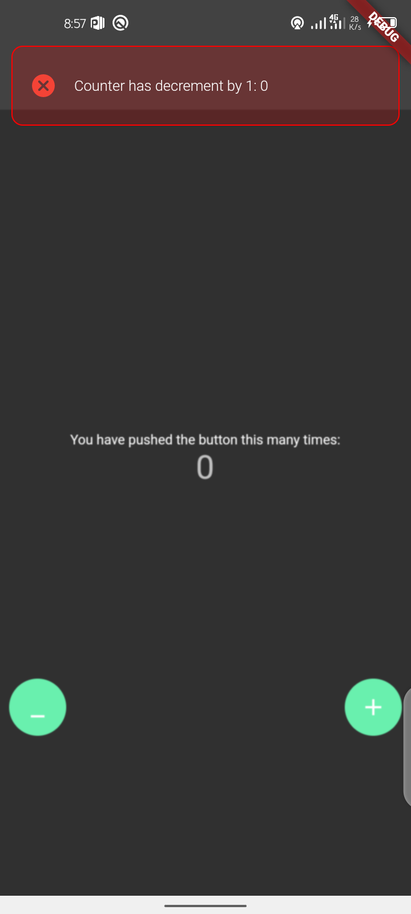
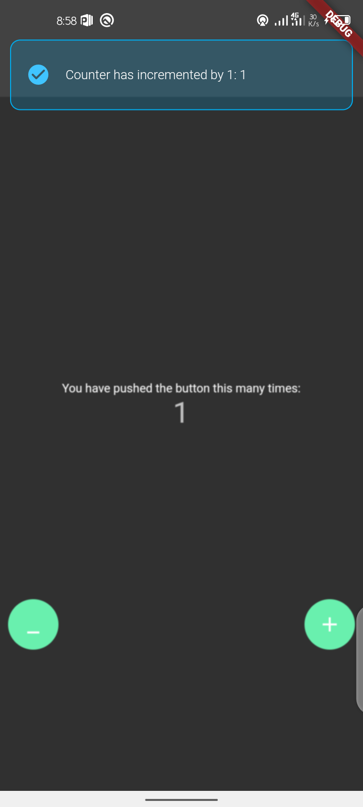

<!--
This README describes the package. If you publish this package to pub.dev,
this README's contents appear on the landing page for your package.

For information about how to write a good package README, see the guide for
[writing package pages](https://dart.dev/guides/libraries/writing-package-pages).

For general information about developing packages, see the Dart guide for
[creating packages](https://dart.dev/guides/libraries/create-library-packages)
and the Flutter guide for
[developing packages and plugins](https://flutter.dev/developing-packages).
-->

## Usage

To use this package add richbar as a dependency in your pubspec.yaml and add this import in your file

```dart
import 'package:richbar/richbar.dart';
```

## Screenshots

 | 1 | 2|
|------|-------|
|||


 | GIF Shot | 
|------|
||


## How to use

Simply create a Richbar widget and pass in the required parameters

```dart
Richbar(
      
      message: message,
      backgroundColor: const Color(0XFF1DA64D),
      duration: const Duration(seconds: 2),
      richbarPosition: RichbarPosition.top,
       leading: const Icon(
        Icons.check_circle_rounded,
        color: Colors.lightBlueAccent,
      ),
    ).show(context);
```

## Quick reference

| Property        |  Purpose                                                                                                   |
| --------------- | --------------------------------------------------------------------------------------------------------------------------------------- |
| message           | message to be displayed                                                                                                             |
| messageColor  | message text color to be displayed                                                                                                      |
| titleFontSize   | message text font size to be displayed                                                                                                  |
| messageFontWeight | message text font weight to be displayed                                                                                                |
| messageAlignment  | message text alignment whether  LEFT or Right, TOP or BOTTOM                                                                                |                                                                                            |
| backgroundColor | message tray background color                                                                                                                   |
| duration        | duration of how long animation should last                                                                            |
| showCurve       | The curve to use in the forward direction                                                                                               |
| dismissCurve    | The curve to use in the forward direction                                                                                               |
| showPulse       | To apply a slow down nice effect during the animation                                                                                   |
| maxWidth        | To set width especially on IPADS                                                                                                        |
| margin          | Empty space to surround the tray widget                                                                                                 |
| padding         | This padding is in addition to any padding inherent in the tray widget                                                                                                             |
| richbarPosition | Specify the entry point of the Tray widget can be [RichbarPosition.top] on top of your screen or [RichbarPosition.bottom] on the bottom |
| onPanDown       | A Callback that fires when user taps the Tray widget                                                                                    |
| onPressed       | A Callback that fires when user taps the Button                                                                                         |
| isDismissible   | Determines if the user can swipe the widget/tray to dismiss.                                                                            |
| onStatusChanged | To listen to the Richbar Status change                                                                                                  |

## MIT License

```
MIT License

Copyright (c) 2022 Dammy Richie

Permission is hereby granted, free of charge, to any person obtaining a copy
of this software and associated documentation files (the "Software"), to deal
in the Software without restriction, including without limitation the rights
to use, copy, modify, merge, publish, distribute, sublicense, and/or sell
copies of the Software, and to permit persons to whom the Software is
furnished to do so, subject to the following conditions:

The above copyright notice and this permission notice shall be included in all
copies or substantial portions of the Software.

THE SOFTWARE IS PROVIDED "AS IS", WITHOUT WARRANTY OF ANY KIND, EXPRESS OR
IMPLIED, INCLUDING BUT NOT LIMITED TO THE WARRANTIES OF MERCHANTABILITY,
FITNESS FOR A PARTICULAR PURPOSE AND NONINFRINGEMENT. IN NO EVENT SHALL THE
AUTHORS OR COPYRIGHT HOLDERS BE LIABLE FOR ANY CLAIM, DAMAGES OR OTHER
LIABILITY, WHETHER IN AN ACTION OF CONTRACT, TORT OR OTHERWISE, ARISING FROM,
OUT OF OR IN CONNECTION WITH THE SOFTWARE OR THE USE OR OTHER DEALINGS IN THE
SOFTWARE.
```
