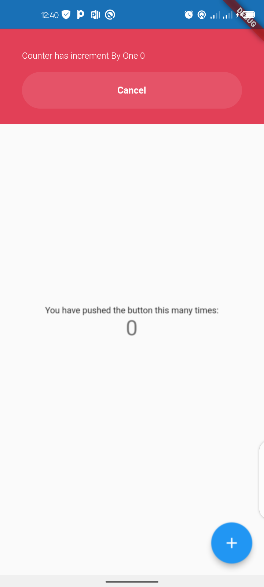
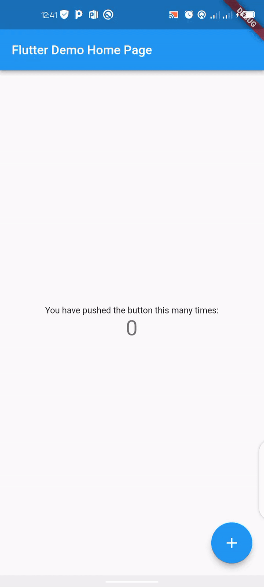

<!--
This README describes the package. If you publish this package to pub.dev,
this README's contents appear on the landing page for your package.

For information about how to write a good package README, see the guide for
[writing package pages](https://dart.dev/guides/libraries/writing-package-pages).

For general information about developing packages, see the Dart guide for
[creating packages](https://dart.dev/guides/libraries/create-library-packages)
and the Flutter guide for
[developing packages and plugins](https://flutter.dev/developing-packages).
-->

## Usage

To use this package add richflushbar as a dependency in your pubspec.yaml and add this import in your file

```
import 'package:richflushbar/richbar_helper.dart';
```

## Screenshots




## How to use

Simply create a Richbar widget and pass in the required parameters

```dart
Richbar(
      title: title!,
      text: action,
      backgroundColor: const Color(0XFF1DA64D),
      duration: const Duration(seconds: 2),
      richbarPosition: RichbarPosition.top,
    );
```

## Quick reference

| Property        | What does it do                                                                                                                         |
| --------------- | --------------------------------------------------------------------------------------------------------------------------------------- |
| title           | message to be displayed                                                                                                                 |
| titleTextColor  | message text color to be displayed                                                                                                      |
| titleFontSize   | message text font size to be displayed                                                                                                  |
| titleFontWeight | message text font weight to be displayed                                                                                                |
| titleAlignment  | message text Alignment to be displayed                                                                                                  |
| text            | button text default is "Dismiss"                                                                                                        |
| textColor       | button text color to be displayed                                                                                                       |
| textFontSize    | button text font size to be displayed                                                                                                   |
| backgroundColor | tray background color                                                                                                                   |
| duration        | is the length of time this animation should last.                                                                                       |
| showCurve       | The curve to use in the forward direction                                                                                               |
| dismissCurve    | The curve to use in the forward direction                                                                                               |
| showPulse       | To apply a slow down nice effect during the animation                                                                                   |
| maxWidth        | To set width especially on IPADS                                                                                                        |
| margin          | Empty space to surround the tray widget                                                                                                 |
| padding         | This padding is in addition to any padding inherent in the tray widget                                                                  |
| padding         | This padding is in addition to any padding inherent in the tray widget                                                                  |
| richbarPosition | Specify the entry point of the Tray widget can be [RichbarPosition.top] on top of your screen or [RichbarPosition.bottom] on the bottom |
| onPanDown       | A Callback that fires when user taps the Tray widget                                                                                    |
| onPressed       | A Callback that fires when user taps the Button                                                                                         |
| isDismissible   | Determines if the user can swipe the widget/tray to dismiss.                                                                            |
| onStatusChanged | To listen to the Richbar Status change                                                                                                  |

## License
MIT License
